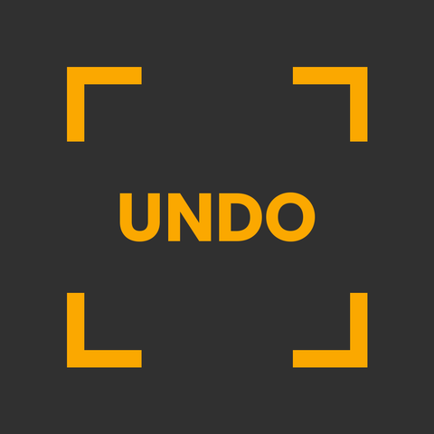

  

  # Understanding Nordic Digital Order

  *Research, software, and film on the digitalization of policing in the Nordics.*

  **[undo-project.info](https://undo-project.info)**

---

## What we do

UNDO is a research initiative working across **Denmark, Finland, and Sweden** to examine how data-driven technologies are reshaping policing and public order. The work combines three modes of inquiry:

- **Empirical research** — qualitative study of police data infrastructures, predictive policing, and biometric systems
- **Software** — open tools for documenting surveillance infrastructure and supporting counter-surveillance practice
- **Documentary film** — work that traces how these systems operate and who they affect

We are critical of the speed and opacity with which many of these systems are deployed, but the work is grounded in how they actually function. The aim is to make their workings legible — to researchers, civil society, and the public — and to support the protection of civil rights as policing becomes more data-driven.

## In this organization

GitHub hosts the **software side** of UNDO. Pinned repositories show current work; topics include CCTV detection, agentic counter-surveillance analysis, and mapping the commercial ecosystem of surveillance technology.

For research outputs, the documentary, workshops, and the wider project, see **[undo-project.info](https://undo-project.info)**.

## Team & funding

Team members are based at [Tampere University](https://www.tuni.fi/en), the [IT University of Copenhagen](https://en.itu.dk/), and the [RåFILM](https://rafilm.se/) filmmakers collective. Funded by the [Kone Foundation](https://koneensaatio.fi) — grant 202207803.

---

contact@undo-project.info

